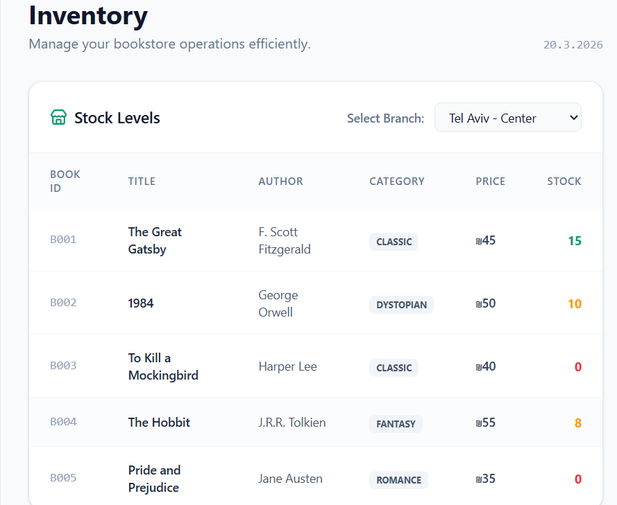
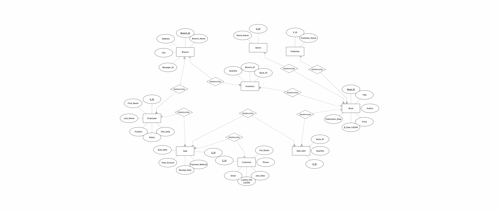
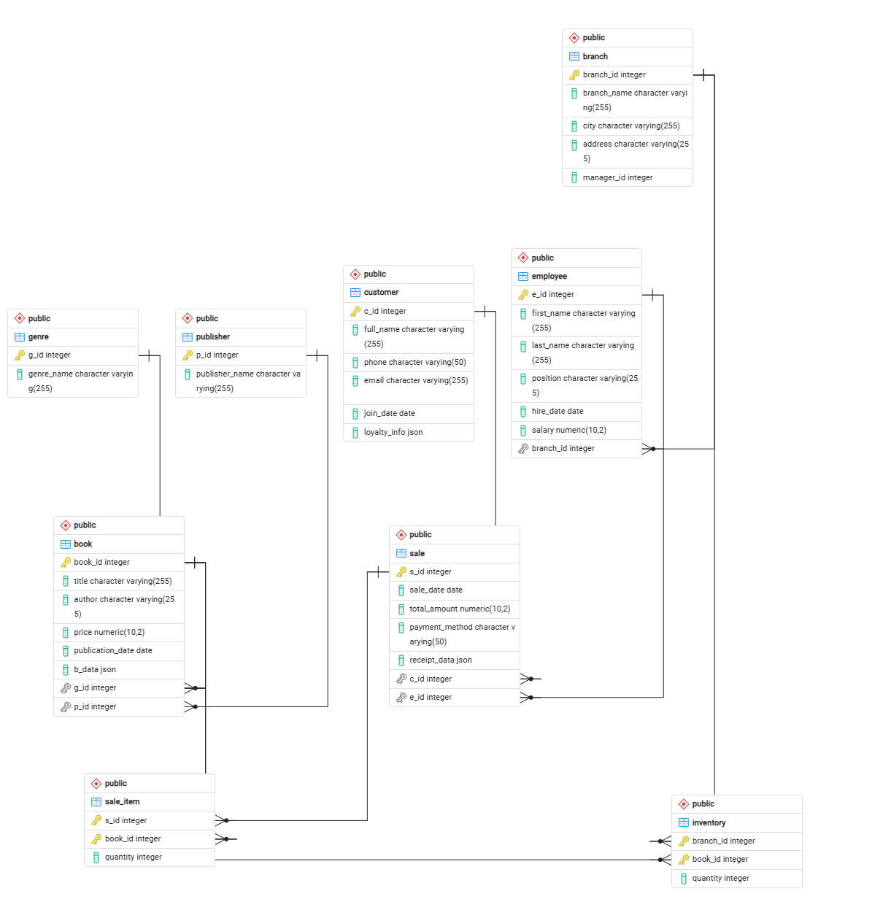
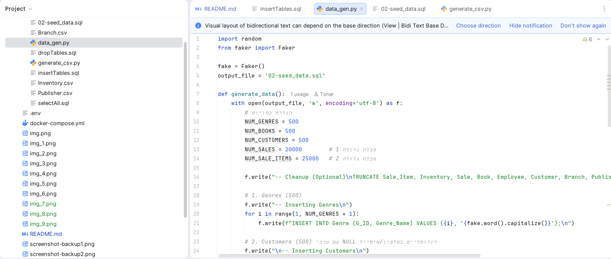
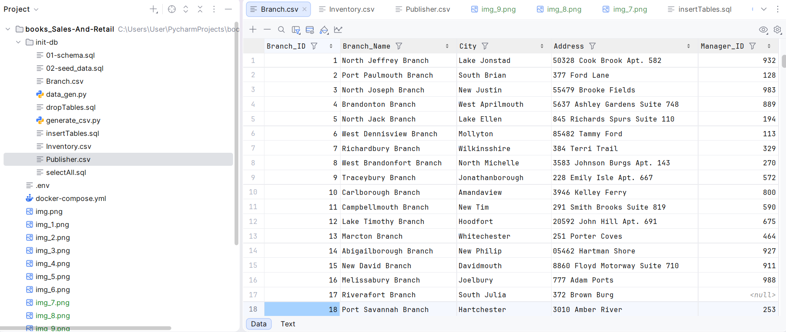
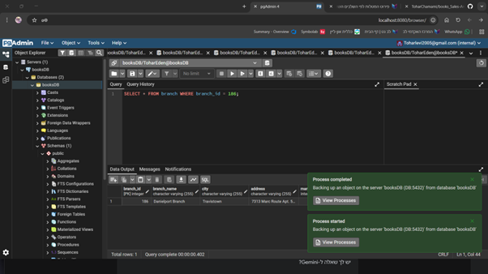

Tohar Levi-Chamami 215108549
Eden Naomi-Hashay 210042453

# books_Sales-And-Retail

1.Introduction and System Description.

2.System analysis TOP DOWN


### ***1.***

This system was designed to manage the sales and retail department of a national bookstore chain.
The system provides a comprehensive solution for managing daily branch activities such as inventory management and more.


#### ***System boundaries and key processes -***


**Catalog and inventory management:** tracking book inventory at each branch, including technical data and genres.

**Customer and Customer Club Management:** Customer registration and club membership dates for future promotions.

**Sales system:** Real-time transaction documentation, including contanting the employee making the purchase and the purchasing customer.

**Workforce Management:** Tracking employees across different branches and their roles.


### ***2.***

At this stage, we have characterized the system interfaces using Google AI Studio.
The goal is to understand the business needs and data flow before building the database.
Below is the characterization of the four screens.





---

## Phase 3: ERD & Database Schema Design (DSD) & Normalization

### 1. Conceptual Design - Entity Relationship Diagram (ERD)

Based on the system screens and user requirements characterized in Phase 2, I have designed the following ERD (Entity Relationship Diagram). This diagram models the 10 core entities and the relationships required to support the application logic


### 2. Database Normalization Analysis
In this phase, I converted the ERD into a relational schema. Each table was analyzed to ensure it meets the requirements of **BCNF (Boyce-Codd Normal Form)** or **3NF**, minimizing redundancy and ensuring data integrity.

| Table Name | Functional Dependencies (FDs) | Normalization Level | Logic / Justification |
| :--- | :--- | :--- | :--- |
| **Genre** | `{G_ID} -> {Genre_Name}` | **BCNF** | The ID is the only determinant and it is a Candidate Key. |
| **Publisher** | `{P_ID} -> {Publisher_Name}` | **BCNF** | Simple key with no transitive dependencies. |
| **Branch** | `{Branch_ID} -> {Branch_Name, City, Address, Manager_ID}` | **BCNF** | All non-key attributes are fully dependent on the Branch_ID. |
| **Customer** | `{C_ID} -> {Full_Name, Phone, Email, Join_Date, Loyalty_Info}` | **BCNF** | Every determinant is a Superkey. |
| **Employee** | `{E_ID} -> {First_Name, Last_Name, Position, Hire_Date, Salary, Branch_ID}` | **BCNF** | Standard 1:N relationship; no partial dependencies. |
| **Book** | `{Book_ID} -> {Title, Author, Price, Publication_Date, B_Data, G_ID, P_ID}` | **BCNF** | Full dependency on the Book_ID. |
| **Sale** | `{S_ID} -> {Sale_Date, Total_Amount, Payment_Method, Receipt_Data, C_ID, E_ID}` | **BCNF** | All sale data depends strictly on the unique Transaction ID. |
| **Inventory** | `{Branch_ID, Book_ID} -> {Quantity}` | **BCNF** | Composite Primary Key. Quantity depends on the specific pair. |
| **Sale_Item** | `{S_ID, Book_ID} -> {Quantity}` | **BCNF** | Composite Primary Key. Quantity depends on the specific Sale/Book pair. |

> **Note on Normalization:** All tables are in **BCNF** because for every non-trivial functional dependency $X \to Y$, $X$ is a superkey. There are no transitive or partial dependencies.

---

### 3. SQL Data Definition Language (DDL)
The following SQL commands implement the design in the PostgreSQL database:
The full SQL script can be found in init-db/01-schema.sql
```sql
-- 1. Simple Entities
CREATE TABLE Genre (
    G_ID INT PRIMARY KEY,
    Genre_Name VARCHAR(255) NOT NULL
);

CREATE TABLE Publisher (
    P_ID INT PRIMARY KEY,
    Publisher_Name VARCHAR(255) NOT NULL
);

CREATE TABLE Branch (
    Branch_ID INT PRIMARY KEY,
    Branch_Name VARCHAR(255) NOT NULL,
    City VARCHAR(255),
    Address VARCHAR(255),
    Manager_ID INT
);

CREATE TABLE Customer (
    C_ID INT PRIMARY KEY,
    Full_Name VARCHAR(255) NOT NULL,
    Phone VARCHAR(50),
    Email VARCHAR(255),
    Join_Date DATE,
    Loyalty_Info JSON
);

-- 2. Entities with Foreign Keys (1:N Relationships)
CREATE TABLE Employee (
    E_ID INT PRIMARY KEY,
    First_Name VARCHAR(255) NOT NULL,
    Last_Name VARCHAR(255) NOT NULL,
    Position VARCHAR(255),
    Hire_Date DATE,
    Salary DECIMAL(10,2),
    Branch_ID INT,
    FOREIGN KEY (Branch_ID) REFERENCES Branch(Branch_ID)
);

CREATE TABLE Book (
    Book_ID INT PRIMARY KEY,
    Title VARCHAR(255) NOT NULL,
    Author VARCHAR(255),
    Price DECIMAL(10,2),
    Publication_Date DATE,
    B_Data JSON,
    G_ID INT,
    P_ID INT,
    FOREIGN KEY (G_ID) REFERENCES Genre(G_ID),
    FOREIGN KEY (P_ID) REFERENCES Publisher(P_ID)
);

CREATE TABLE Sale (
    S_ID INT PRIMARY KEY,
    Sale_Date DATE,
    Total_Amount DECIMAL(10,2),
    Payment_Method VARCHAR(50),
    Receipt_Data JSON,
    C_ID INT,
    E_ID INT,
    FOREIGN KEY (C_ID) REFERENCES Customer(C_ID),
    FOREIGN KEY (E_ID) REFERENCES Employee(E_ID)
);

-- 3. Junction Tables (M:N Relationships)
CREATE TABLE Inventory (
    Branch_ID INT,
    Book_ID INT,
    Quantity INT DEFAULT 0,
    PRIMARY KEY (Branch_ID, Book_ID),
    FOREIGN KEY (Branch_ID) REFERENCES Branch(Branch_ID),
    FOREIGN KEY (Book_ID) REFERENCES Book(Book_ID)
);

CREATE TABLE Sale_Item (
    S_ID INT,
    Book_ID INT,
    Quantity INT NOT NULL,
    PRIMARY KEY (S_ID, Book_ID),
    FOREIGN KEY (S_ID) REFERENCES Sale(S_ID),
    FOREIGN KEY (Book_ID) REFERENCES Book(Book_ID)
);
```

---

## Phase 4: Data Population, Backup & Restore

### 1. Data Population Methods
The database was populated using three distinct methods to reach over 20,000 records:
* **Python (Faker Library):** Generated mass data for Sales and Customers.
The script generates relational data while maintaining referential integrity between tables.



* **CSV Import:** Imported structured data for Branches, Publishers, and Inventory.



* **Mockaroo:** Generated the Employee table in SQL format.


### 2. Backup & Restore Procedures
To ensure data durability, I implemented two backup strategies:
1. **Full Backup (Custom Format):** A complete binary backup of the database.
2. **Schema-Only Backup:** A backup of the table structures.

#### **Restore Verification**
The backup was tested by restoring it into a new database named `books_restore_test`. 
* **Verification Query:** `SELECT COUNT(*) FROM Sale;`
* **Result:** The system successfully recovered all records.

#### **System Proof (Screenshots):**



