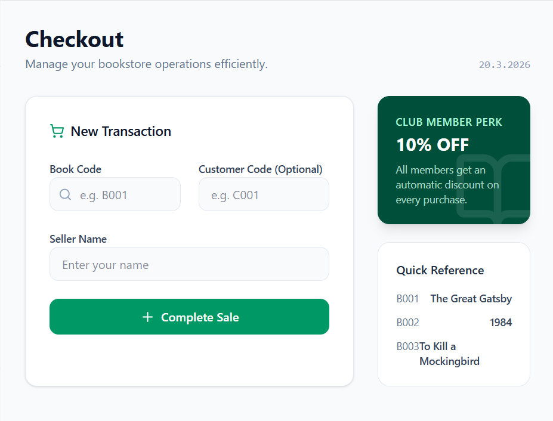
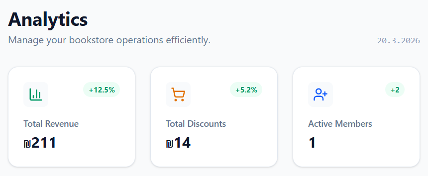
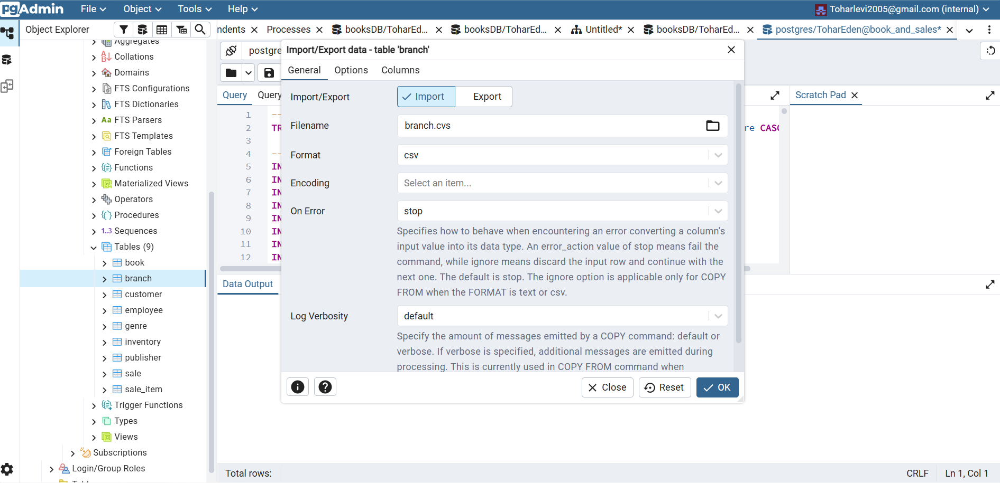
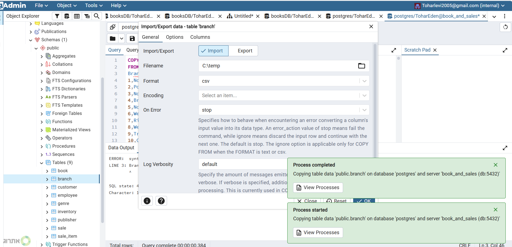

Tohar Levi-Chamami 215108549
Eden Naomi-Hashay 210042453

# books_Sales-And-Retail

1.Introduction and System Description.

2.System analysis TOP DOWN


### ***1.***

This system was designed to manage the sales and retail department of a national bookstore chain.
The system provides a comprehensive solution for managing daily branch activities such as inventory management and more.


#### ***System boundaries and key processes -***


**Catalog and inventory management:** tracking book inventory at each branch, including technical data and genres.

**Customer and Customer Club Management:** Customer registration and club membership dates for future promotions.

**Sales system:** Real-time transaction documentation, including contanting the employee making the purchase and the purchasing customer.

**Workforce Management:** Tracking employees across different branches and their roles.


### ***2.***

At this stage, we have characterized the system interfaces using Google AI Studio.
The goal is to understand the business needs and data flow before building the database.
Below is the characterization of the four screens.








---

## Phase 3: ERD & Database Schema Design (DSD) & Normalization

### 1. Conceptual Design - Entity Relationship Diagram (ERD)

Based on the system screens and user requirements characterized in Phase 2, I have designed the following ERD (Entity Relationship Diagram). This diagram models the 10 core entities and the relationships required to support the application logic


### Data Dictionary

#### 1. Table: Genre
**Purpose:** Manages book categories to ensure data consistency and avoid duplication.

| Column Name | Data Type | Constraints | Description |
| :--- | :--- | :--- | :--- |
| **G_ID** | INT | PRIMARY KEY | Unique identifier for each genre. |
| **Genre_Name** | VARCHAR(255) | NOT NULL | The name of the category (e.g., Fiction, Science, History). |

#### 2. Table: Publisher
**Purpose:** Stores information about the publishing houses the bookstore works with.

| Column Name | Data Type | Constraints | Description |
| :--- | :--- | :--- | :--- |
| **P_ID** | INT | PRIMARY KEY | Unique identifier for the publisher. |
| **Publisher_Name** | VARCHAR(255) | NOT NULL | The official name of the publishing house. |

#### 3. Table: Branch
**Purpose:** Manages physical bookstore locations and logistics.

| Column Name | Data Type | Constraints | Description |
| :--- | :--- | :--- | :--- |
| **Branch_ID** | INT | PRIMARY KEY | Unique branch identification number. |
| **Branch_Name** | VARCHAR(255) | NOT NULL | Name of the specific branch. |
| **City** | VARCHAR(255) | - | The city where the branch is located. |
| **Address** | VARCHAR(255) | - | Full physical address of the branch. |
| **Manager_ID** | INT | - | ID of the employee managing this branch. |

#### 4. Table: Customer
**Purpose:** Maintains records for bookstore customers and loyalty club members.

| Column Name | Data Type | Constraints | Description |
| :--- | :--- | :--- | :--- |
| **C_ID** | INT | PRIMARY KEY | Unique customer identification number. |
| **Full_Name** | VARCHAR(255) | NOT NULL | Full name of the customer. |
| **Phone** | VARCHAR(50) | - | Contact phone number. |
| **Email** | VARCHAR(255) | - | Customer's email address. |
| **Join_Date** | DATE | - | The date the customer joined the system (Significant Date 1). |
| **Loyalty_Info** | JSON | - | Flexible data regarding points and rewards in JSON format. |

#### 5. Table: Employee
**Purpose:** Manages human resources and staff assignments across branches.

| Column Name | Data Type | Constraints | Description |
| :--- | :--- | :--- | :--- |
| **E_ID** | INT | PRIMARY KEY | Unique employee identification number. |
| **First_Name** | VARCHAR(255) | NOT NULL | Employee's first name. |
| **Last_Name** | VARCHAR(255) | NOT NULL | Employee's last name. |
| **Position** | VARCHAR(255) | - | The job title/role of the employee. |
| **Hire_Date** | DATE | - | The date the employee started working. |
| **Salary** | DECIMAL(10,2) | - | Monthly salary with two decimal precision. |
| **Branch_ID** | INT | FOREIGN KEY | Links the employee to their assigned branch. |

#### 6. Table: Book
**Purpose:** The central catalog of all book titles available in the retail network.

| Column Name | Data Type | Constraints | Description |
| :--- | :--- | :--- | :--- |
| **Book_ID** | INT | PRIMARY KEY | Unique identifier for the book (e.g., ISBN). |
| **Title** | VARCHAR(255) | NOT NULL | The title of the book. |
| **Author** | VARCHAR(255) | - | The name of the book's author. |
| **Price** | DECIMAL(10,2) | - | The catalog price of the book. |
| **Publication_Date**| DATE | - | Official release date (Significant Date 2). |
| **B_Data** | JSON | - | Additional metadata and attributes in JSON format. |
| **G_ID** | INT | FOREIGN KEY | Links the book to its respective Genre. |
| **P_ID** | INT | FOREIGN KEY | Links the book to its respective Publisher. |

#### 7. Table: Sale
**Purpose:** Records the header information for every sales transaction.

| Column Name | Data Type | Constraints | Description |
| :--- | :--- | :--- | :--- |
| **S_ID** | INT | PRIMARY KEY | Unique transaction/invoice number. |
| **Sale_Date** | DATE | - | The date the transaction occurred. |
| **Total_Amount** | DECIMAL(10,2) | - | Final total amount paid for the transaction. |
| **Payment_Method** | VARCHAR(50) | - | Method of payment (e.g., Cash, Credit Card). |
| **Receipt_Data** | JSON | - | Digital copy of the receipt stored in JSON. |
| **C_ID** | INT | FOREIGN KEY | The customer who made the purchase. |
| **E_ID** | INT | FOREIGN KEY | The employee who processed the sale. |

#### 8. Table: Inventory
**Purpose:** Manages the M:N relationship between branches and books.

| Column Name | Data Type | Constraints | Description |
| :--- | :--- | :--- | :--- |
| **Branch_ID** | INT | PK, FK | Link to the specific branch. |
| **Book_ID** | INT | PK, FK | Link to the specific book. |
| **Quantity** | INT | DEFAULT 0 | Number of copies currently in stock at this branch. |

#### 9. Table: Sale_Item
**Purpose:** Detail table recording each specific book included in a sale.

| Column Name | Data Type | Constraints | Description |
| :--- | :--- | :--- | :--- |
| **S_ID** | INT | PK, FK | Link to the main Sale record. |
| **Book_ID** | INT | PK, FK | Link to the specific book purchased. |
| **Quantity** | INT | NOT NULL | The number of units purchased in this transaction. |

### 2. Database Normalization Analysis
In this phase, I converted the ERD into a relational schema. Each table was analyzed to ensure it meets the requirements of **BCNF (Boyce-Codd Normal Form)** or **3NF**, minimizing redundancy and ensuring data integrity.

| Table Name | Functional Dependencies (FDs) | Normalization Level | Logic / Justification |
| :--- | :--- | :--- | :--- |
| **Genre** | `{G_ID} -> {Genre_Name}` | **BCNF** | The ID is the only determinant and it is a Candidate Key. |
| **Publisher** | `{P_ID} -> {Publisher_Name}` | **BCNF** | Simple key with no transitive dependencies. |
| **Branch** | `{Branch_ID} -> {Branch_Name, City, Address, Manager_ID}` | **BCNF** | All non-key attributes are fully dependent on the Branch_ID. |
| **Customer** | `{C_ID} -> {Full_Name, Phone, Email, Join_Date, Loyalty_Info}` | **BCNF** | Every determinant is a Superkey. |
| **Employee** | `{E_ID} -> {First_Name, Last_Name, Position, Hire_Date, Salary, Branch_ID}` | **BCNF** | Standard 1:N relationship; no partial dependencies. |
| **Book** | `{Book_ID} -> {Title, Author, Price, Publication_Date, B_Data, G_ID, P_ID}` | **BCNF** | Full dependency on the Book_ID. |
| **Sale** | `{S_ID} -> {Sale_Date, Total_Amount, Payment_Method, Receipt_Data, C_ID, E_ID}` | **BCNF** | All sale data depends strictly on the unique Transaction ID. |
| **Inventory** | `{Branch_ID, Book_ID} -> {Quantity}` | **BCNF** | Composite Primary Key. Quantity depends on the specific pair. |
| **Sale_Item** | `{S_ID, Book_ID} -> {Quantity}` | **BCNF** | Composite Primary Key. Quantity depends on the specific Sale/Book pair. |

> **Note on Normalization:** All tables are in **BCNF** because for every non-trivial functional dependency $X \to Y$, $X$ is a superkey. There are no transitive or partial dependencies.

---

### 3. SQL Data Definition Language (DDL)
The following SQL commands implement the design in the PostgreSQL database:
The full SQL script can be found in init-db/01-schema.sql
```sql
-- 1. Simple Entities
CREATE TABLE Genre (
    G_ID INT PRIMARY KEY,
    Genre_Name VARCHAR(255) NOT NULL
);

CREATE TABLE Publisher (
    P_ID INT PRIMARY KEY,
    Publisher_Name VARCHAR(255) NOT NULL
);

CREATE TABLE Branch (
    Branch_ID INT PRIMARY KEY,
    Branch_Name VARCHAR(255) NOT NULL,
    City VARCHAR(255),
    Address VARCHAR(255),
    Manager_ID INT
);

CREATE TABLE Customer (
    C_ID INT PRIMARY KEY,
    Full_Name VARCHAR(255) NOT NULL,
    Phone VARCHAR(50),
    Email VARCHAR(255),
    Join_Date DATE,
    Loyalty_Info JSON
);

-- 2. Entities with Foreign Keys (1:N Relationships)
CREATE TABLE Employee (
    E_ID INT PRIMARY KEY,
    First_Name VARCHAR(255) NOT NULL,
    Last_Name VARCHAR(255) NOT NULL,
    Position VARCHAR(255),
    Hire_Date DATE,
    Salary DECIMAL(10,2),
    Branch_ID INT,
    FOREIGN KEY (Branch_ID) REFERENCES Branch(Branch_ID)
);

CREATE TABLE Book (
    Book_ID INT PRIMARY KEY,
    Title VARCHAR(255) NOT NULL,
    Author VARCHAR(255),
    Price DECIMAL(10,2),
    Publication_Date DATE,
    B_Data JSON,
    G_ID INT,
    P_ID INT,
    FOREIGN KEY (G_ID) REFERENCES Genre(G_ID),
    FOREIGN KEY (P_ID) REFERENCES Publisher(P_ID)
);

CREATE TABLE Sale (
    S_ID INT PRIMARY KEY,
    Sale_Date DATE,
    Total_Amount DECIMAL(10,2),
    Payment_Method VARCHAR(50),
    Receipt_Data JSON,
    C_ID INT,
    E_ID INT,
    FOREIGN KEY (C_ID) REFERENCES Customer(C_ID),
    FOREIGN KEY (E_ID) REFERENCES Employee(E_ID)
);

-- 3. Junction Tables (M:N Relationships)
CREATE TABLE Inventory (
    Branch_ID INT,
    Book_ID INT,
    Quantity INT DEFAULT 0,
    PRIMARY KEY (Branch_ID, Book_ID),
    FOREIGN KEY (Branch_ID) REFERENCES Branch(Branch_ID),
    FOREIGN KEY (Book_ID) REFERENCES Book(Book_ID)
);

CREATE TABLE Sale_Item (
    S_ID INT,
    Book_ID INT,
    Quantity INT NOT NULL,
    PRIMARY KEY (S_ID, Book_ID),
    FOREIGN KEY (S_ID) REFERENCES Sale(S_ID),
    FOREIGN KEY (Book_ID) REFERENCES Book(Book_ID)
);
```

---

## Phase 4: Data Population, Backup & Restore

### 1. Data Population Methods
The database was populated using three distinct methods to reach over 20,000 records:
* **Python (Faker Library):** Generated mass data for Sales and Customers.
The script generates relational data while maintaining referential integrity between tables.


* **CSV Import:** Imported structured data for Branches, Publishers, and Inventory.




* **Mockaroo:** Generated the Employee table in SQL format.


### 2. Backup & Restore Procedures
To ensure data durability, I implemented two backup strategies:
1. **Full Backup (Custom Format):** A complete binary backup of the database.
2. **Schema-Only Backup:** A backup of the table structures.

#### **Restore Verification**
The backup was tested by restoring it into a new database named `books_restore_test`. 
* **Verification Query:** `SELECT COUNT(*) FROM Sale;`
* **Result:** The system successfully recovered all records.

#### **System Proof (Screenshots):**


שלב ב
--
SELECT
--
#1.
--
תיאור השאילתא: שליפת רשימת לקוחות (שם ואימייל) שרכשו לפחות ספר אחד המשתייך לז'אנר מסוים (למשל, ז'אנר 1).

קוד השאילתא:
--
```sql
SELECT C_ID, first_name, last_name, Email
FROM Customer
WHERE C_ID IN (
    SELECT C_ID FROM Sale WHERE S_ID IN (
        SELECT S_ID FROM Sale_Item WHERE Book_ID IN (
            SELECT Book_ID FROM Book WHERE G_ID = 1
        )
    )
)
ORDER BY first_name, last_name;
```
הרצה ותוצאה:
--


קוד השאילתא:
--
```sql
SELECT DISTINCT c.C_ID, c.first_name, c.last_name, c.Email, b.Title
FROM Customer c
JOIN Sale s ON c.C_ID = s.C_ID
JOIN Sale_Item si ON s.S_ID = si.S_ID
JOIN Book b ON si.Book_ID = b.Book_ID
WHERE b.G_ID = 1
ORDER BY c.first_name, c.last_name;
```
הרצה ותוצאה:
--


הסבר יעילות:
--
שאילתת JOIN יעילה יותר מ-IN מקונן. השימוש ב-JOIN מאפשר לאופטימייזר לבצע חיבור ישיר של האינדקסים במעבר אחד, בעוד ש-IN מקונן עלול ליצור טבלאות זמניות בזיכרון.


#2.
--
הצגת עסקאות מעל הממוצע, כולל פרטי העובד והסניף המבצע

קוד השאילתא:
--
```sql
SELECT s.S_ID, s.Sale_Date, s.Total_Amount, br.Branch_Name, e.First_Name, e.Last_Name
FROM Sale s
JOIN Employee e ON s.E_ID = e.E_ID
JOIN Branch br ON e.Branch_ID = br.Branch_ID
JOIN (SELECT AVG(Total_Amount) AS AvgAmount FROM Sale) AS DerivedTable
ON s.Total_Amount > DerivedTable.AvgAmount
ORDER BY s.Total_Amount DESC;
```
הרצה ותוצאה:
--


קוד השאילתא:
--
```sql
SELECT b.Book_ID, b.Title, b.Price, g.Genre_Name, b.Author
FROM Book b
JOIN Genre g ON b.G_ID = g.G_ID
WHERE b.Price = (
    SELECT MAX(b2.Price)
    FROM Book b2
    WHERE b2.G_ID = b.G_ID
)
ORDER BY g.Genre_Name;
```
הרצה ותוצאה:
--


הסבר יעילות:
--
שאילתת JOIN יעילה יותר מ-IN מקונן. השימוש ב-JOIN מאפשר לאופטימייזר לבצע חיבור ישיר של האינדקסים במעבר אחד, בעוד ש-IN מקונן עלול ליצור טבלאות זמניות בזיכרון.


#3.
--
שליפת הספר בעל המחיר הגבוה ביותר לכל קטגוריה ללא שימוש ב-LIMIT.

קוד השאילתא:
--
```sql
SELECT b.Book_ID, b.Title, b.Price, g.Genre_Name, b.Author
FROM Book b
JOIN Genre g ON b.G_ID = g.G_ID
WHERE b.Price = (
    SELECT MAX(b2.Price)
    FROM Book b2
    WHERE b2.G_ID = b.G_ID
)
ORDER BY g.Genre_Name;

```
הרצה ותוצאה:
--


קוד השאילתא:
--
```sql
SELECT b.Book_ID, b.Title, b.Price, g.Genre_Name, b.Author
FROM Book b
JOIN Genre g ON b.G_ID = g.G_ID
JOIN (
    SELECT G_ID, MAX(Price) AS MaxPrice
    FROM Book
    GROUP BY G_ID
) AS MaxBooks ON b.G_ID = MaxBooks.G_ID AND b.Price = MaxBooks.MaxPrice
ORDER BY g.Genre_Name;
```
הרצה ותוצאה:
--


הסבר יעילות:
--
אפשרות ב' יעילה משמעותית. בשאילתה קורלטיבית (א'), השאילתה הפנימית עלולה לרוץ מחדש עבור כל שורה בטבלת הספרים. ב-ב', מתבצע GROUP BY חד-פעמי על כל הטבלה, והחיבור מתבצע על בסיס סט התוצאות המצומצם.


#4.
--
איתור חוסרים במלאי בסניפים הנמצאים בעיר מסוימת (למשל: תל אביב).

קוד השאילתא:
--
```sql
SELECT br.Branch_Name, br.City, b.Title, b.Author, i.Quantity
FROM Inventory i
JOIN Branch br ON i.Branch_ID = br.Branch_ID
JOIN Book b ON i.Book_ID = b.Book_ID
WHERE i.Quantity = 0 AND br.City = 'Tel Aviv'
ORDER BY br.Branch_Name;

```
הרצה ותוצאה:
--


קוד השאילתא:
--
```sql
SELECT br.Branch_Name, br.City, b.Title, b.Author, i.Quantity
FROM Inventory i
JOIN Book b ON i.Book_ID = b.Book_ID
JOIN Branch br ON i.Branch_ID = br.Branch_ID
WHERE i.Quantity = 0 AND i.Branch_ID IN (
    SELECT Branch_ID
    FROM Branch
    WHERE City = 'Tel Aviv'
)
ORDER BY br.Branch_Name;
```
הרצה ותוצאה:
--


הסבר יעילות:
--

שאילתא א' לרוב עדיפה מכיוון שהיא עושה שימוש ישיר ב-Foreign Keys. עם זאת, שאילתא ב' עשויה להיות יעילה יותר בבסיסי נתונים גדולים מאוד אם הסינון של ה-City מקטין משמעותית את כמות הרשומות הנסרקות בתוך ה-JOIN המרכזי.


#5.
--
הפקת דוח המציג את כמות המכירות וההכנסות הכוללות בכל חודש עבור כל סניף בנפרד.
קוד השאילתא:
--
```sql
SELECT
    EXTRACT(YEAR FROM s.Sale_Date) AS Sale_Year,
    EXTRACT(MONTH FROM s.Sale_Date) AS Sale_Month,
    br.Branch_Name,
    COUNT(s.S_ID) AS Total_Sales_Count,
    SUM(s.Total_Amount) AS Total_Revenue
FROM Sale s
JOIN Employee e ON s.E_ID = e.E_ID
JOIN Branch br ON e.Branch_ID = br.Branch_ID
GROUP BY
    EXTRACT(YEAR FROM s.Sale_Date),
    EXTRACT(MONTH FROM s.Sale_Date),
    br.Branch_Name
ORDER BY
    Sale_Year DESC,
    Sale_Month DESC,
    Total_Revenue DESC;

```
הרצה ותוצאה:
--


#6.
--
זיהוי עובדים מצטיינים אשר הניבו הכנסות מצטברות הגבוהות מ-5,000 ש"ח.
קוד השאילתא:
--
```sql

SELECT e.E_ID, e.First_Name, e.Last_Name, br.Branch_Name, COUNT(s.S_ID) AS Number_Of_Sales, SUM(s.Total_Amount) AS Total_Generated_Revenue
FROM Employee e
JOIN Sale s ON e.E_ID = s.E_ID
JOIN Branch br ON e.Branch_ID = br.Branch_ID
GROUP BY e.E_ID, e.First_Name, e.Last_Name, br.Branch_Name
HAVING SUM(s.Total_Amount) > 5000.00
ORDER BY Total_Generated_Revenue DESC;


```
הרצה ותוצאה:
--


#7.
--
איתור לקוחות שנרשמו לפני שנת 2026 אך מעולם לא ביצעו רכישה ברשת.

קוד השאילתא:
--
```sql

SELECT c.C_ID, c.Full_Name, c.Email, c.Join_Date
FROM Customer c
WHERE c.Join_Date < '2026-01-01'
  AND NOT EXISTS (
      SELECT 1
      FROM Sale s
      WHERE s.C_ID = c.C_ID
  )
ORDER BY c.Join_Date ASC;


```
הרצה ותוצאה:
--


#8.
--
ספירת כמות הספרים הייחודיים וסך המלאי הקיים בכל רשת, מחולק לפי מוציא לאור וסוג הז'אנר.

קוד השאילתא:
--
```sql

SELECT p.Publisher_Name, g.Genre_Name, COUNT(DISTINCT b.Book_ID) AS Distinct_Books_Count, SUM(i.Quantity) AS Total_Stock_In_Network
FROM Book b
JOIN Publisher p ON b.P_ID = p.P_ID
JOIN Genre g ON b.G_ID = g.G_ID
JOIN Inventory i ON b.Book_ID = i.Book_ID
GROUP BY p.Publisher_Name, g.Genre_Name
ORDER BY p.Publisher_Name, Total_Stock_In_Network DESC;


```
הרצה ותוצאה:
--


UPDATE
--


1. עדכון מחיר לספרים (העלאת מחירים של 10% לכל הספרים בז'אנר מסוים, למשל פנטזיה שזה קוד 1):

```sql
UPDATE book
SET current_price = current_price * 1.10
WHERE g_id = 1;
```
before:


after:


2. עדכון מלאי (הגיעה סחורה חדשה לסניף 1 עבור ספר 1, מוסיפים 10 עותקים):

```sql
UPDATE inventory
SET quantity = quantity + 10
WHERE branch_id = 1 AND book_id = 1;
```
before:


after:


3. עדכון כתובת אימייל של לקוח (לקוח 901 שקודם הכנסנו):
```sql
UPDATE customer
SET email = 'yossi.new.email@email.com'
WHERE c_id = 901;
```
before:

after:


DELETE
--
1. מחיקת לקוח (נמחק את אחת מהלקוחות הפיקטיביות שהוספנו קודם, מיכל, כי היא מעולם לא קנתה כלום ואין לה היסטוריה שחוסמת מחיקה):

```sql
UPDATE inventory 
SET quantity = quantity + 10 
WHERE branch_id = 1 AND book_id = 1;
```
before:

after:


2. מחיקת רשומת מלאי שאזל (ניקוי מלאי של 0 עותקים מסניף 1):

```sql
DELETE FROM inventory 
WHERE quantity = 0 AND branch_id = 1;
```

before:

after:


3. מחיקת לקוח נוסף (נמחק גם את דוד שהוספנו קודם):

```sql
DELETE FROM customer 
WHERE c_id = 903;
```

before:


after:


CONSTRAINTS:
--
 אילוץ 1: מחיר ספר חייב להיות חיובי

```sql
ALTER TABLE book ADD CONSTRAINT chk_positive_price CHECK (current_price > 0);
```

אילוץ 2: כמות במלאי לא יכולה להיות שלילית
```sql
ALTER TABLE inventory ADD CONSTRAINT chk_non_negative_quantity CHECK (quantity >= 0);
```

אילוץ 3: אימייל של לקוח חייב להכיל שטרודל
```sql
ALTER TABLE customer ADD CONSTRAINT chk_valid_email CHECK (email LIKE '%@%');
```


ROLLBACK
--
```
SELECT book_id, title, current_price FROM book WHERE book_id = 1;
```

```
BEGIN;
UPDATE book SET current_price = current_price + 50 WHERE book_id = 1;
```
```
SELECT book_id, title, current_price FROM book WHERE book_id = 1;
```

```
ROLLBACK;
```
```
SELECT book_id, title, current_price FROM book WHERE book_id = 1;
```


COMMIT
--
```
SELECT book_id, title, current_price FROM book WHERE book_id = 2;```
```

```
BEGIN;
UPDATE book SET current_price = current_price - 10 WHERE book_id = 2;
```
```
SELECT book_id, title, current_price FROM book WHERE book_id = 2;```
```

```
COMMIT;
```
```
SELECT book_id, title, current_price FROM book WHERE book_id = 2;```
```


INDEX
--
 1. אינדקס על תאריך המכירה (עוזר מאוד לשאילתות של דוחות חודשיים/שנתיים)

האינדקס מאפשר למסד הנתונים לבצע Index Scan במקום Sequential Scan (סריקה של כל הטבלה), מה שמקצר משמעותית את זמן הגישה לשורות הרלוונטיות.


```
CREATE INDEX idx_sale_date ON sale(sale_date);
```


 2. אינדקס על שם הספר (עוזר כשלקוחות או עובדים מחפשים ספר לפי כותרת)

בטבלאות עם כמות גדולה של ספרים, חיפוש מחרוזת ללא אינדקס הוא פעולה יקרה. האינדקס מספק כתובת ישירה לרשומה.


```
CREATE INDEX idx_book_title ON book(title);
```

 3. אינדקס על אימייל הלקוח (עוזר לאיתור מהיר של כרטיס לקוח במערכת)

עמודת האימייל היא ייחודית (Unique). אינדקס עליה מבטיח שליפה כמעט מיידית, גם כשהטבלה מכילה אלפי לקוחות.


```
CREATE INDEX idx_customer_email ON customer(email);
```


חלק ג: אינטגרציה ומבטים
--
### ERD של האגף החדש: ###

### DSD של האגף החדש: ###

### אלגוריתם הנדוס לאחור (Reverse Engineering): ###

זיהוי ישויות (Entities): נסרוק את כל הטבלאות בבסיס הנתונים שקיבלנו. כל טבלה עצמאית (שאינה טבלת קישור) תוגדר כישות בתרשים ה-ERD.

זיהוי תכונות (Attributes): עבור כל ישות, נמפה את העמודות בטבלה כתכונות של הישות. המפתח הראשי (Primary Key) של הטבלה יסומן כתכונה המזהה (המודגשת בקו).

זיהוי קשרים (Relationships) מסוג 1:N (יחיד לרבים): נחפש עמודות שהן מפתחות זרים (Foreign Keys). נסיר אותן מרשימת התכונות של הישות, ובמקומן נמתח קשר מסוג 1:N אל הטבלה שממנה נלקח המפתח (הצד של ה-1 יהיה בטבלת האב, והצד של ה-N יהיה בטבלה המכילה את המפתח הזר).

זיהוי קשרים מסוג N:M (רבים לרבים): נאתר טבלאות קישור (טבלאות שהמפתח הראשי שלהן מורכב משני מפתחות זרים או יותר, כגון טבלת פריטי הזמנה). נהפוך טבלאות אלו לקשר מעוין מסוג N:M המקשר בין שתי ישויות האב.

### ERD משותף: ###
```
-- === 1. הכנת הטבלאות וקישורן ===
-- הוספת העמודות החדשות מהמערכת השנייה לטבלת הספרים שלנו
ALTER TABLE book
ADD COLUMN publication_year INT,
ADD COLUMN publisher_id INT;

-- יצירת מפתח זר שמקשר את הספרים שלנו להוצאות לאור
ALTER TABLE book
ADD CONSTRAINT fk_publisher
FOREIGN KEY (publisher_id)
REFERENCES publishers(publisher_id);

-- === 2. העברת נתונים חסרים (כדי למנוע שגיאות מפתח זר) ===
-- העברת כל הספרים של הזוג השני שחסרים אצלנו, תוך מתן מחיר ברירת מחדל של 50
INSERT INTO book (book_id, title, author, publication_year, publisher_id, current_price)
SELECT book_id, title, author, publication_year, publisher_id, 50
FROM books
WHERE book_id NOT IN (SELECT book_id FROM book);

-- העברת כל העובדים החדשים שחסרים אצלנו (מותאם לעמודת e_id שלך)
INSERT INTO employee (e_id, first_name, last_name)
SELECT employee_id, first_name, last_name
FROM employees
WHERE employee_id NOT IN (SELECT e_id FROM employee);

-- === 3. הניקיון הסופי: מחיקת הטבלאות הכפולות וחיבור החוטים מחדש ===
-- טיפול בספרים
DROP TABLE IF EXISTS books CASCADE;
ALTER TABLE stored_in ADD CONSTRAINT fk_book_unified FOREIGN KEY (book_id) REFERENCES book(book_id);

-- טיפול בעובדים
DROP TABLE IF EXISTS employees CASCADE;
ALTER TABLE purchase_orders ADD CONSTRAINT fk_emp_unified FOREIGN KEY (employee_id) REFERENCES employee(e_id);

DROP TABLE IF EXISTS publisher CASCADE;
```

### DSD לאחר אינטגרציה: ###

### החלטות שנעשו בשלב האינטגרציה (עיצוב ה-ERD המשולב): ###

בתהליך האינטגרציה בין מערכת "מכירות חנות הספרים" לבין מערכת "ניהול רכש ומחסנים", קיבלנו את ההחלטות העיצוביות הבאות:

איחוד ישויות חופפות (Entity Resolution): זיהינו כי הישות Book קיימת בשתי המערכות. החלטנו לאחד אותן לישות אחת מרכזית. הישות המאוחדת מכילה כעת את כלל התכונות: נתוני מכירה (מחיר, ז'אנר) מתוך המערכת המקורית, ונתוני רכש (סופר, שנת הוצאה, הוצאה לאור) מתוך המערכת החדשה.

שילוב מערכות מלאי מבוזרות: המערכת המקורית ניהלה מלאי ברמת ה"סניף" (inventory), בעוד המערכת החדשה ניהלה מלאי ברמת "מחסן מרכזי" (stored_in). החלטנו להשאיר את שתי הישויות נפרדות אך מקושרות לאותו עץ מוצר (Book), מתוך הבנה עסקית שמחסנים מרכזיים (Warehouses) מקבלים סחורה מהספקים, והסניפים המקומיים (Branches) מושכים את המלאי למכירה ללקוחות הקצה.

טיפול במפתחות זרים כפולים: בתהליך האיחוד של טבלת הספרים, וידאנו שהמפתח הראשי (book_id) יהיה אחיד וישמש כמזהה גלובלי (Global ID) בשתי תתי-המערכות כדי למנוע יתירות נתונים.